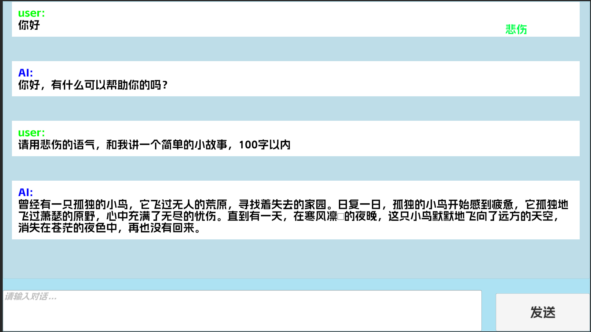
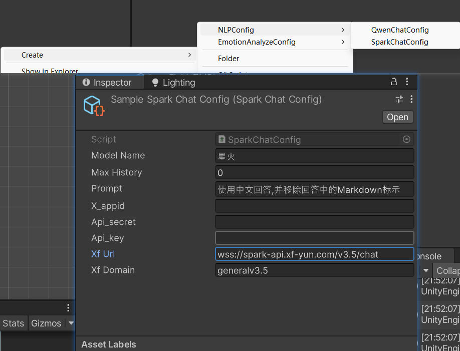

# UnityTalkAI
 一个接入语言模型Api实现的对话项目。

因为方便测试，使用的语言模型为星火认知大模型和通义千问。

## 功能

 **通过请求API服务，在Unity中进行AI聊天。**

 项目中以有的模型有OpenAI的ChatGPT，阿里的统义千问，讯飞的星火大模型，创建对应配置文件即可使用。

 (ps:无视不全的TMP字体)

### **NLP Helper**.cs

**包含了网络请求以及处理功能。**

- **Arguments**

	- 【sendDataList】用于储存用户的历史聊天记录，并且每次发送的内容都是基于该list。

		若List长度超过Config的最大长度限制时，删除部分历史内容。

	- 【onReceiveMessage】发送请求成功后处理的数据

		 处理好的信息会通过UnityEvent<string>发送出去。

		

	- 【OpenAIConfig】OpenAI的相关配置文件

		继承NLPConfig类的配置文件，主要是记录APIkey，不同模型的配置可能不同，参考模型API具体的官方文档。

		

- **Methods**

	-  **Init()**

		初始化Helper

	- **PostMessage(string message)**

		将message储存到sendDataList中，并发起API请求。

		请求成功后，将接收到的信息通过onReceiveMessage事件传递。

		

		

### **EmotionAnalyzeAli.cs**

** 包含了阿里云情绪识别分析功能。**

- **Arguments**

​	【config】情绪识别配置文件

- **Methods**
	- **GetEmotion(string context)**

​		将需要处理的文本通过该方法发送。

​		返回结果为(string emotion, string allEmotionJson) 的元组

​		其中，emotion为AI推断最有可能的情绪。allEmotionJson为所有分析结果。

### NLPConfig.cs

- 【modelName】 模型名称，用于区分不同版本的模型
- 【maxHistory】最大历史消息附带数量
- 【prompt】预设人设信息

## 使用

API的配置信息构建了ScriptableObject脚本，通过右键创建配置挂到模型GameObject上即可。

脚本的调用方法可以参考Sample.cs脚本。

## Reference

[TMP字体来源-阿里巴巴普惠](https://www.alibabafonts.com/#/home)

[阿里巴巴SDK](https://help.aliyun.com/zh/sdk/developer-reference/v2-0-dotnet-sdk?spm=a2c4g.11174283.0.0.6a3c3a11hGi2ux)

[通义千问](https://tongyi.aliyun.com/qianwen/)

[星火大模型](https://xinghuo.xfyun.cn/)

